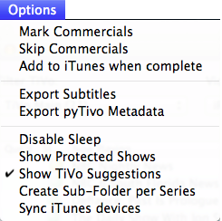
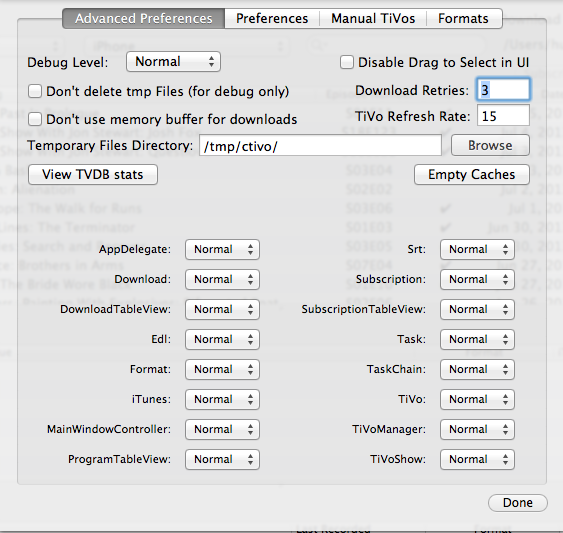

#Configuration
## How to configure cTiVo operation

Although cTiVo should be easy to approach and use, it is also intended to be very configurable, letting the user set things up just the way they want.

The two most important configuration parameters are on top of the screen: the video format to create and the Download Directory location where to store the resulting videos. The [Video Formats](Video-Formats.md) decision is complicated, so we've created a [separate page](Video-Formats.md) for it.

## Options

In addition to the Format/Download directory choices above, you can set many other options. The "Options" menu lets you set many of the download parameters quickly. These can also be set in the "Preferences" screen. Note that these options apply to any new downloads/subscriptions, but once it's in the queue, or subscribed, you can change these options and not affect ones in progress.

These are grouped in two main groups: the Recording/Metadata handling options which apply to each individual download and the General settings that apply to the entire program:

### Recordings Preferences

These are options that affect the individual downloads. Each of these can also be set/changed for each individual download or subscription
- **Skip Commercials** means after downloading, run a program called "comskip" that attempts to remove commercials from your shows. This process is dependent on a wide variety of parameters, so some find this a great feature, some find it frustrating as it may miss some commercials or even delete program material accidentally. Note that the current version of comskip can also fail entirely on certain recordings; when this happens, cTiVo will provide an alert, but continue other processing of the download. Note also that skipping commercials can only be done with the "mencoder" encoder. More information at [comskip's website](http://www.kaashoek.com/comskip).
- **Mark Commercials** still uses comskip, but will instead add chapter information to your shows, so that you can easily skip over commercials in your player. Thus if comskip makes a mistake, you can simply back up. Also, marking commercials can be done in conjunction with any encoder, as long as output file type is MPEG-compatible (.MPG, .MP4, .MOV, or .M4V). Enabling this option will automatically disable Skip Commercials and vice-versa.
- **Add to iTunes When Complete** will launch iTunes and add the video and its metadata to your library. See [Subscriptions](Subscriptions.md) for more information.
### Metadata Handling Preferences

Metadata is the information that TiVo provides about the video, such as Series name, episode number, recording date, etc. cTiVo can deliver that information in a variety of ways depending on what you would like to then do with it. Again, each of these can be set/changed for each individual download or subscription.
- **Export Subtitles** (*Handle Captions* in Preferences) extracts any captions or subtitles from the video file before encoding and stores them in a standard .SRT format. If the output file is MPEG-compatible, it will also store them inside the file for a viewer to use.
- **Export Metadata to pyTivo** will save the metadata in a .TXT as defined by the [pyTiVo program](http://pytivo.sourceforge.net/wiki/index.php/PyTivo) (which lets your Mac act as a TiVo server over the network). This allows the information to go on a round-trip to your TiVo.
### General Settings

These are the preferences that apply to the operation of the entire program, not individual downloads. These are also available in the Preferences screen.
- **Disable sleep** does what it says. It will attempt to delay the Mac's sleep until processing is complete. It is strongly recommended not to use this option while on battery power. Note that it will not override a "hard sleep", such as low power or closing the lid on a MacBook.
- **Show Protected Shows** will display those shows that are marked as "copy-protected" on the TiVo. See [I have shows on my TiVo that are not listed on cTiVo!](FAQ) These shows cannot be downloaded, but for completeness, you may see them if you wish.
- **Show TiVo Suggestions** TiVos will record shows that it thinks you may like. This option lets you see, or not see, those shows as you wish. Note that each subscription also has the same option.
- **Create Sub-folders for Series** will create separate named folders within your Download Folder for each series you download or subscribe to.
- **Sync iTunes Devices** will ask iTunes to start a device sync after cTivo has loaded a new show. If your devices are set to automatically load the latest videos, this will ensure that your shows are available on your devices as soon as possible.
### Settings in Preferences screen

These are in addition to the ones that are also in the Options menu above.
- **Warn if Quitting during download** is just a user preference. Some folks don't like warning messages when quitting. However, if you quit during a download or encoding, you will lose any work done on that download, and cTiVo will have to restart the job when it is next run. If you enable the warning, we will give you the option to finish the current job before then quitting.
- **Scheduling** lets you set a period of time in the day to process your queue. As encoding video is very CPU intensive, you might set up all your subscriptions/downloads, then all the processing could start at 1:00AM, and stop at 6AM. To avoid losing work, the currently downloading show will be completed after the stop time, but no further jobs will be started.
- **Log Level** controls how much information is written to the system log file. This would primarily used to provide debugging information in the case of a problem of operation.
- **Delete file after copying into iTunes** If you have enabled "Add to iTunes When Completed", and iTunes is set to copy files into its own directory, then cTiVo will normally delete the duplicate file unless you clear this option.
- **Use cTiVo logo for video file** cTiVo can attach an image to represent the video file. Normally a random frame near the beginning of the program is chosen; if you'd like all your TiVo video files to have the same icon, you can set this setting.
- **Get artwork from TheTVDB** will attempt to download episode-specific images chosen by fans on TheTVDB website for the shows you are downloading. If you'd rather use series or season-specific artwork, see [Advanced Topics](Advanced-Topics.md#Artwork).
## Available Columns

By right-clicking onto the column headers of the three tables, you can hide or show any information you like. Clicking on a column header will sort the table by that column.  Here's a list of the available columns:
## Now Playing Columns

- **TiVo**:  Which TiVo this show is recorded on.
- **Que'd**: Whether this show is currently in the download table. (Note that shows are boldfaced if the successfully downloaded video file is still available on the drive).
- **Now Playing**: Also known as Show Title, this field combines the series name and the episode name into one column.
- **Series/Episode**: If you prefer the names in two separate columns, you can activate these two columns instead.
- **Episode Number**: the season/episode number of this show (or just episode number).
- **Episode ID**: a unique identifier for this particular show, good across TiVos. For example, this ID is used to determine whether a show has been downloaded for a subscription already or not. You can look up shows on theTVDB with this number.
- **Genre**: what kind of show this is.
- **Size**: The estimated size of the file to be transferred (before video encoding which will usually dramatically reduce this size).
- **Length**: The time in hours and minutes that the show lasts.
- **Date**: The date/time that the show was recorded.
- **First Air**: The date/time that the show was first aired (or for a Movie, the year that it was released).
- **HD**: whether the show was recorded in High-Definition.
- **Channel**: what channel number the show was recorded on.
- **Station**: what channel callsign the show was recorded on.
- **Genre**: which genre does TiVo believe the show belongs in.
- **TiVo ID**: a unique number for each show that identifies it to the TiVo.
- **Status**: The TiVo icons that indicate how soon a show will be deleted. Will also show the TiVo logo for suggested shows, a red C for copy-protected, a blue ? when cTivo doesn't know the status yet, or a red X when the show has been deleted from the TiVo.

## Download Table Columns

(Many of the Now Playing columns are also available here to identify which show is being downloaded)
- **##**: The position in the download queue. Shows with smaller numbers are downloaded first, although two TiVos can download simultaneously.
- **Download Queue**: Same as Now Playing above, but this field also shows status of current download with an orange bar showing amount downloaded or encoded so far.
- **Format**: Which format will cTiVo use to encode this show? You can change this until the encoding starts.
- **iTunes**: Will this show be added to iTunes after encoding?
- **Mark**: Will this show have its commercials marked?
- **Skip**: Will this show have its commercials removed?
- **Subtitles**: Should cTiVo generate subtitles for this show?
- **pyTiVo**: Will this show have its metadata exported for use by pyTiVo?
## Subscription Table Columns

In addition to the Format/iTunes/Mark/Skp/Subtitles/pyTivo columns as above (which are simply copied into the download table item when a subscription is triggered), the subscription table has the following columns:
- **Subscriptions**: The show name subscribed to.
- **Last Recorded**: The latest downloaded episode.
- **TiVo**: Allows you to restrict which TiVo this subscription applies to.
- **HD only/SD only**:  Whether this subscription applies to HD or SD shows only.
- **Suggestions**: Whether this subscription will include TiVo suggestions.